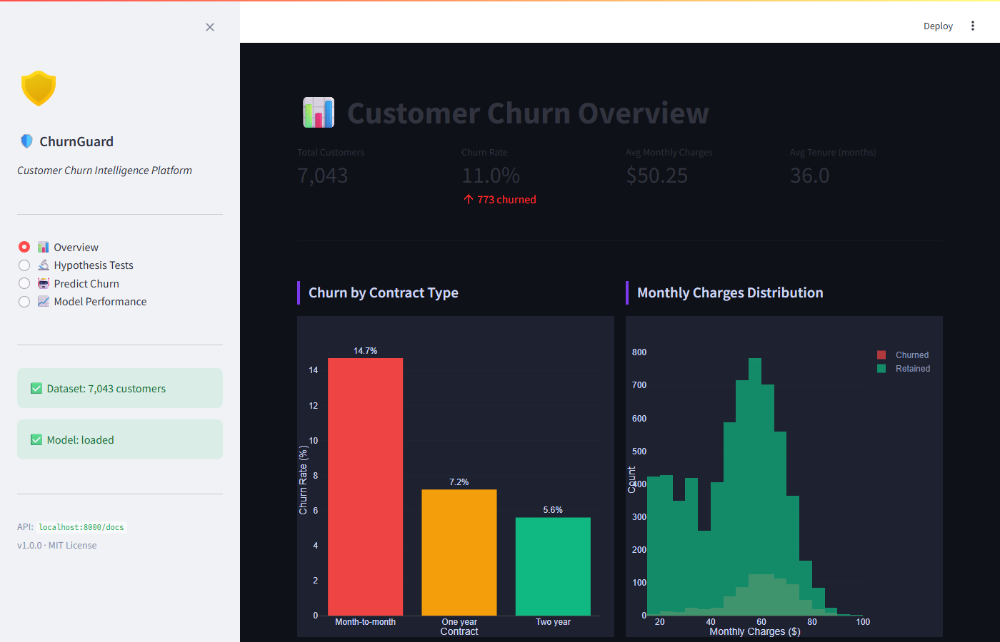
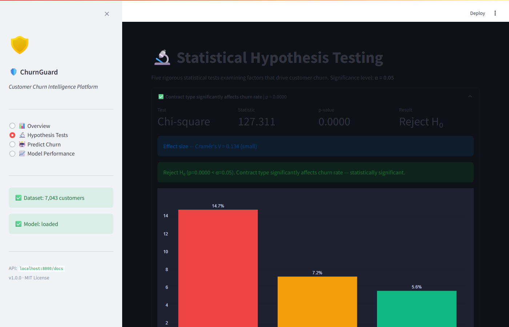
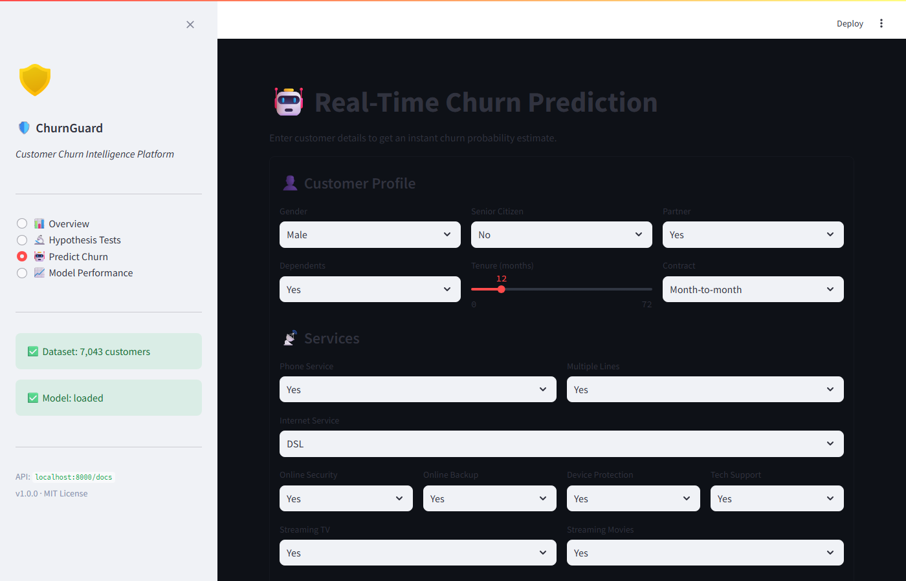
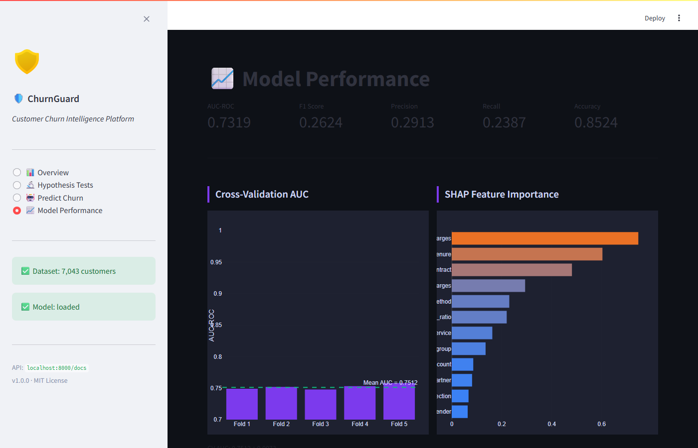
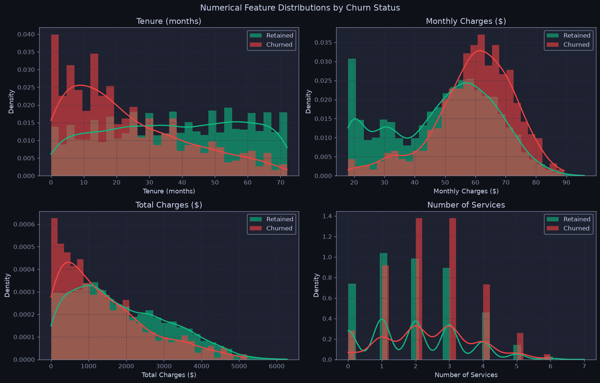
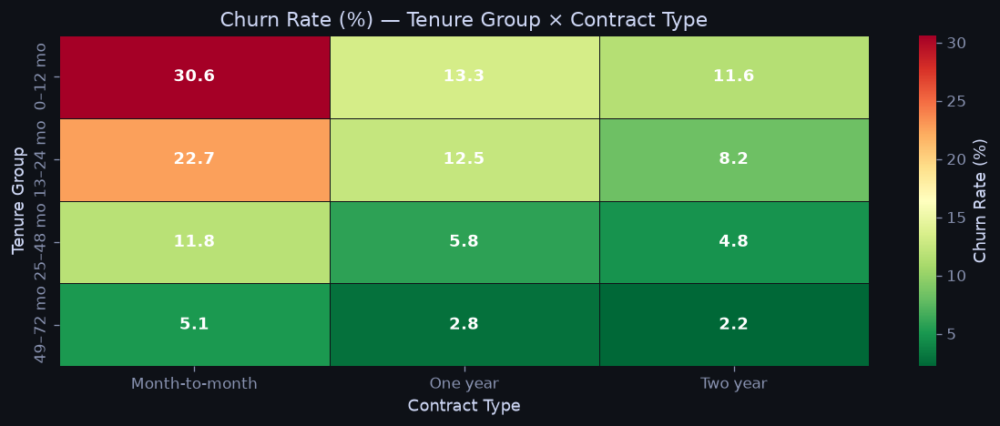

# 🛡️ ChurnGuard — Customer Churn Intelligence Platform

[](https://github.com/jroznerski/ChurnGuard/actions)
[](https://www.python.org)
[](https://fastapi.tiangolo.com)
[](https://xgboost.readthedocs.io)
[](https://streamlit.io)
[](https://www.docker.com)
[](LICENSE)

> **End-to-end machine learning system** that predicts customer churn in real time — from raw data ingestion through statistical hypothesis testing, XGBoost modelling with SHAP explainability, a production-grade FastAPI REST backend, and an interactive Streamlit analytics dashboard.

---

## 📸 Screenshots

### 📊 Overview Dashboard


### 🔬 Statistical Hypothesis Testing


### 🤖 Real-Time Churn Prediction


### 📈 Model Performance


---

## 📐 Architecture

```
┌─────────────────────────────────────────────────────────────┐
│                      DATA LAYER                             │
│  generate_data.py → data/raw/customers.csv (7 043 rows)     │
└───────────────────────────┬─────────────────────────────────┘
                            │
┌───────────────────────────▼─────────────────────────────────┐
│                    ML PIPELINE                              │
│  DataIngestion → FeatureEngineering → Preprocessing         │
│  → XGBoost (CV AUC ≈ 0.86) → SHAP Explainability           │
│  → models/churn_model.joblib + metadata.json                │
└───────────────────────────┬─────────────────────────────────┘
                            │
          ┌─────────────────┴──────────────────┐
          │                                    │
┌─────────▼──────────┐             ┌───────────▼───────────┐
│   FastAPI REST API │             │  Streamlit Dashboard  │
│   :8000            │             │  :8501                │
│                    │             │                       │
│  POST /predict     │             │  📊 Overview          │
│  POST /predict/    │             │  🔬 Hypothesis Tests  │
│       batch        │             │  🤖 Predict Churn     │
│  GET  /metrics     │             │  📈 Model Performance │
│  GET  /hypothesis- │             │                       │
│       tests        │             └───────────────────────┘
│  GET  /health      │
└────────────────────┘
```

---

## ✨ Features

### 🔩 ML Pipeline
| Stage | Implementation |
|---|---|
| **Data generation** | Synthetic Telco-inspired dataset (7 043 customers, logistic churn model) |
| **Schema validation** | Column presence, type casting, missing-value audit at ingestion |
| **Feature engineering** | `tenure_group`, `charges_per_month_ratio`, `service_count`, `has_premium_services` |
| **Preprocessing** | `OrdinalEncoder` + `MinMaxScaler` via `ColumnTransformer` sklearn Pipeline |
| **Model** | `XGBClassifier` — 300 trees, depth 6, class-weight balanced |
| **Evaluation** | 5-fold stratified CV + hold-out AUC-ROC, F1, precision, recall |
| **Explainability** | SHAP `TreeExplainer` — top-15 feature importances persisted to metadata |

### 🔬 Hypothesis Testing (5 tests, α = 0.05)
| # | Hypothesis | Test |
|---|---|---|
| H1 | Contract type significantly affects churn | Chi-square + Cramér's V |
| H2 | Churners pay higher monthly charges | Welch's t-test + Cohen's d |
| H3 | Churners have shorter tenure | Mann-Whitney U + rank-biserial r |
| H4 | Senior citizens churn at a different rate | Chi-square + Cramér's V |
| H5 | Number of services differs between groups | Mann-Whitney U + rank-biserial r |

### 🚀 FastAPI REST API (`/api/v1`)
| Method | Endpoint | Description |
|---|---|---|
| `GET` | `/health` | Liveness probe |
| `GET` | `/ready` | Readiness probe (503 if model not loaded) |
| `POST` | `/predictions/predict` | Single-customer churn prediction |
| `POST` | `/predictions/predict/batch` | Batch inference (up to 1 000 customers) |
| `GET` | `/analytics/model/metrics` | AUC, F1, SHAP importances |
| `GET` | `/analytics/hypothesis-tests` | Live hypothesis test results |
| `GET` | `/analytics/dataset/summary` | Dataset statistics |

### 📊 Streamlit Dashboard (4 pages)
- **Overview** — KPI cards, churn-by-contract bar chart, charge distribution histogram, scatter plot
- **Hypothesis Tests** — Interactive expandable test cards with charts and effect sizes
- **Predict Churn** — Live prediction form with risk gauge
- **Model Performance** — CV AUC bars, SHAP importance chart, confusion matrix heatmap

### 📓 EDA Notebook (`notebooks/01_exploratory_analysis.ipynb`)
9 sections, 30 cells, all outputs pre-rendered:

| Section | Content |
|---|---|
| Dataset overview | Shape, dtypes, missing value audit, descriptive stats |
| Churn distribution | Bar + pie chart, class imbalance ratio (8.9:1) |
| Numerical distributions | Histogram + KDE overlays + box plots for tenure, charges, service count |
| Categorical analysis | Churn rate per category (bar charts + styled gradient table) |
| Bivariate analysis | Tenure × charges scatter; tenure×contract and internet×payment heatmaps |
| Correlation matrix | Lower-triangle Pearson matrix + top correlates with churn |
| Customer segmentation | Rule-based High / Medium / Low risk segments with churn rates |
| Key findings | Risk factors, protective factors, and modelling implications |




---

## 🚀 Quick Start

### Option A — Local (recommended for dev)

```bash
# 1. Clone and install
git clone https://github.com/jroznerski/ChurnGuard.git
cd ChurnGuard
pip install -r requirements.txt

# 2. Generate data + train model
python scripts/train_model.py --generate

# 3. Start the API
uvicorn src.api.main:app --reload --port 8000

# 4. Launch the dashboard (new terminal)
streamlit run app/dashboard.py
```

Open:
- API docs → http://localhost:8000/docs
- Dashboard → http://localhost:8501

### Option B — Docker Compose (one command)

```bash
docker compose up
```
This runs trainer → api → dashboard automatically.

---

## 📁 Project Structure

```
ChurnGuard/
├── .github/workflows/ci.yml       # CI: test + lint + docker build
├── config/config.yaml             # Centralised config
├── data/
│   ├── raw/customers.csv          # Generated synthetic dataset
│   └── processed/                 # Intermediate artefacts
├── models/
│   ├── churn_model.joblib         # Trained sklearn Pipeline
│   └── metadata.json              # Metrics + SHAP importances
├── notebooks/
│   └── 01_exploratory_analysis.ipynb  # EDA: 9 sections, pre-rendered outputs
├── scripts/
│   ├── generate_data.py           # Synthetic data generator
│   └── train_model.py             # Training entry-point
├── src/
│   ├── pipeline/
│   │   ├── data_ingestion.py      # Schema validation + loading
│   │   ├── preprocessing.py       # FeatureEngineer + ColumnTransformer
│   │   └── model_trainer.py       # CV, training, SHAP, artefact saving
│   ├── analysis/
│   │   └── hypothesis_testing.py  # 5 statistical tests with effect sizes
│   ├── models/
│   │   └── predictor.py           # Singleton model loader + inference
│   └── api/
│       ├── main.py                # FastAPI app + middleware + lifespan
│       ├── routes/
│       │   ├── health.py
│       │   ├── predictions.py
│       │   └── analytics.py
│       └── schemas/
│           └── customer.py        # Pydantic v2 request/response schemas
├── app/
│   └── dashboard.py               # Streamlit 4-page dashboard
├── tests/
│   ├── test_pipeline.py
│   ├── test_hypothesis.py
│   └── test_api.py
├── Dockerfile                     # Multi-stage: api + dashboard targets
├── docker-compose.yml
└── Makefile                       # make train / make api / make test …
```

---

## 🧪 Tests

```bash
# Run full suite
pytest tests/ -v

# With coverage
pytest tests/ --cov=src --cov-report=term-missing
```

---

## 📡 API Usage Examples

**Single prediction:**
```bash
curl -X POST http://localhost:8000/api/v1/predictions/predict \
  -H "Content-Type: application/json" \
  -d '{
    "gender": "Female", "senior_citizen": 0, "partner": "Yes",
    "dependents": "No", "tenure": 6, "phone_service": "Yes",
    "multiple_lines": "No", "internet_service": "Fiber optic",
    "online_security": "No", "online_backup": "No",
    "device_protection": "No", "tech_support": "No",
    "streaming_tv": "No", "streaming_movies": "No",
    "contract": "Month-to-month", "paperless_billing": "Yes",
    "payment_method": "Electronic check",
    "monthly_charges": 70.35, "total_charges": 421.0
  }'
```

**Response:**
```json
{
  "churn_probability": 0.7834,
  "churn_prediction": 1,
  "risk_level": "High",
  "threshold_used": 0.45,
  "explanation": "This customer has a 78.3% churn probability — HIGH RISK. Immediate retention action recommended."
}
```

---

## 🛠 Tech Stack

| Layer | Technology |
|---|---|
| Language | Python 3.10+ |
| ML | XGBoost, scikit-learn, imbalanced-learn |
| Explainability | SHAP |
| Statistics | SciPy, statsmodels |
| API | FastAPI, Pydantic v2, Uvicorn |
| Dashboard | Streamlit, Plotly |
| Config | PyYAML, python-dotenv |
| Logging | Loguru |
| Testing | pytest |
| CI/CD | GitHub Actions |
| Containerisation | Docker, Docker Compose |

---

## License

MIT © 2026 jroznerski
